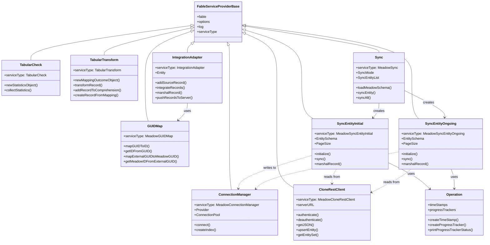

# Architecture

This document describes the architectural design of Meadow Integration, covering both the data transformation and data synchronization pipelines.

## High-Level System Architecture

Meadow Integration sits between external data sources and the Meadow data access layer. It provides three interfaces (CLI, REST, Programmatic) that share a common set of services.

<!-- bespoke diagram: edit diagrams/high-level-system-architecture.mmd or .hints.json, then: npx pict-renderer-graph build modules/meadow/meadow-integration/docs -->

The system divides cleanly into two pipelines that share the `Operation` utility for timing and progress tracking.

## Data Transformation Pipeline

The transformation pipeline converts tabular data into Meadow entity records. Each stage is a discrete service that can be used independently.

<!-- bespoke diagram: edit diagrams/data-transformation-pipeline.mmd or .hints.json, then: npx pict-renderer-graph build modules/meadow/meadow-integration/docs -->

### Stage Details

**Parse** -- CSV and TSV files are streamed through a parser that emits one record per row. JSON Array files are loaded and iterated. The `TabularCheck` service can analyze records without transforming them, producing column statistics.

**Transform** -- The `TabularTransform` service applies a three-layer configuration cascade to each record:

1. **Implicit** -- Auto-generated from the first record's keys (column names become field names, the first column is used for GUID generation)
2. **Explicit** -- Loaded from a mapping file that specifies entity name, GUID template, and column-to-field mappings
3. **User** -- Command-line overrides for entity name, GUID name, GUID template, and inline column mappings

Each layer merges on top of the previous one using `Object.assign`, so User settings always win.

Pict template expressions resolve column values at transformation time. Solvers (powered by the Fable Expression Parser) enable multi-entity extraction from a single source row by dynamically generating multiple GUID uniqueness entries.

**Collect** -- Transformed records accumulate in a Comprehension object. Records with duplicate GUIDs within the same parse are merged. Records can also be merged with an existing Comprehension loaded from disk.

**Push** -- The `IntegrationAdapter` marshals comprehension records into Meadow-compatible format. It fetches the target entity schema from the Meadow API, validates field types, truncates strings that exceed schema-defined sizes, and strips reserved columns (`CreateDate`, `UpdateDate`, `Deleted`, `DeleteDate`). Cross-entity GUID references are resolved through the `GUIDMap`. Records are pushed via upsert -- individually for small sets, or in configurable bulk batches (default threshold: 1000 records, batch size: 100) for large sets.

## Data Synchronization Pipeline

The Data Clone pipeline replicates entity data from a remote Meadow API into a local relational database.

<!-- bespoke diagram: edit diagrams/data-synchronization-pipeline.mmd or .hints.json, then: npx pict-renderer-graph build modules/meadow/meadow-integration/docs -->

### Stage Details

**Authenticate** -- The `CloneRestClient` authenticates with the remote Meadow API by posting credentials to `/Authenticate`. The resulting session cookie or token is attached to all subsequent requests. If no credentials are configured, authentication is skipped (for unauthenticated APIs). HTTP keep-alive is enabled for connection reuse.

**Connect** -- The `ConnectionManager` establishes a connection pool to the local database. It supports MySQL (via `meadow-connection-mysql`) and MSSQL (via `meadow-connection-mssql`). The provider is selected by the `Destination.Provider` configuration key.

**Initialize Schema** -- The Meadow extended schema JSON (produced by Stricture's `build` command) is loaded. For each entity in the schema (or a configured subset), the sync service uses the Meadow provider to create the table if it does not exist. It then creates a unique index on the GUID column and a non-unique index on the Deleted column using the `ConnectionManager`.

**Sync Entities** -- Entities are synced sequentially in the order defined by `SyncEntityList` (or schema order if the list is empty). Two sync strategies are available:

- **Initial** -- Queries the local max ID and the remote max ID and record count. Generates paginated URL partials filtered to records with IDs greater than the local maximum. Downloads each page and creates records locally with identity insert enabled so primary keys match the remote system.
- **Ongoing** -- Extends Initial sync with `UpdateDate` comparison. After identifying new records by ID, it also compares `UpdateDate` timestamps. Records where the remote `UpdateDate` differs from the local `UpdateDate` by more than 5 milliseconds are updated. This handles both new records and modifications.

## Service Dependency Diagram

All services extend `fable-serviceproviderbase` and register with a Fable instance. The diagram below shows the dependency relationships.

## Configuration Cascade

Configuration for the CLI flows through multiple layers, each overriding the previous.

<!-- bespoke diagram: edit diagrams/configuration-cascade.mmd or .hints.json, then: npx pict-renderer-graph build modules/meadow/meadow-integration/docs -->

For data transformation, the mapping configuration has its own three-layer cascade:

<!-- bespoke diagram: edit diagrams/configuration-cascade-2.mmd or .hints.json, then: npx pict-renderer-graph build modules/meadow/meadow-integration/docs -->

## Sync Mode Comparison

The two sync modes serve different purposes and have different performance characteristics.

<!-- bespoke diagram: edit diagrams/sync-mode-comparison.mmd or .hints.json, then: npx pict-renderer-graph build modules/meadow/meadow-integration/docs -->

| Aspect | Initial | Ongoing |
|--------|---------|---------|
| **Purpose** | First-time clone or catch-up | Incremental sync of changes |
| **Strategy** | Only downloads records with IDs above local max | Walks all records and compares timestamps |
| **Handles new records** | Yes | Yes |
| **Handles updates** | No | Yes (by UpdateDate comparison) |
| **Performance** | Faster for first clone (skips existing) | Slower per run but keeps data current |
| **Typical usage** | Run once, then switch to Ongoing | Run on a schedule (cron, Docker) |

## Docker Deployment

The included Dockerfile builds a production image for running Data Clone as a containerized service. The image is based on `node:20-bookworm` and expects a `.meadow.config.json` to be provided at runtime (via volume mount or baked into a derived image).

<!-- bespoke diagram: edit diagrams/docker-deployment.mmd or .hints.json, then: npx pict-renderer-graph build modules/meadow/meadow-integration/docs -->

The `docker-compose.yml` can be used to run the Data Clone alongside a local MySQL or MSSQL container for development and testing.
